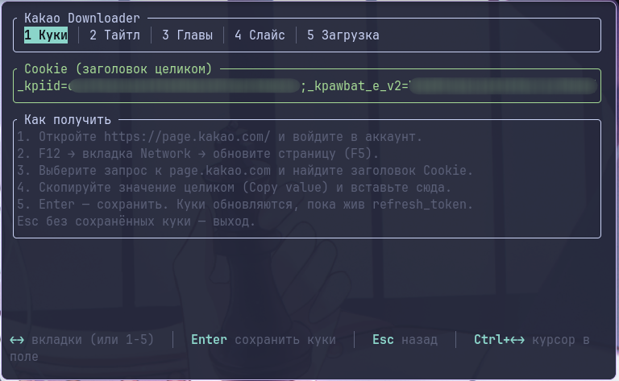
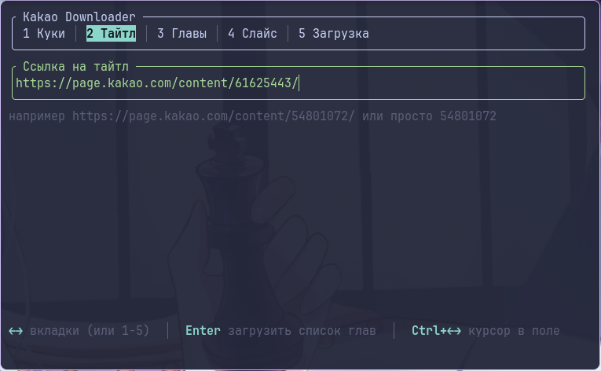
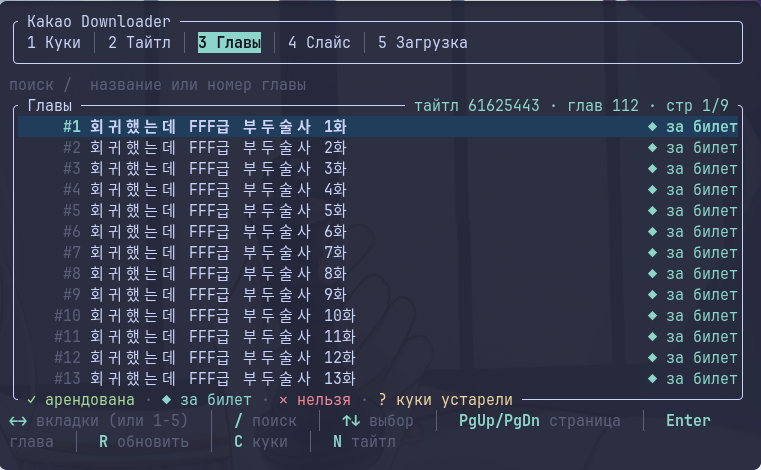
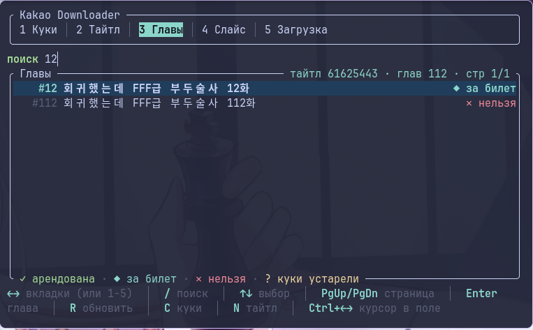
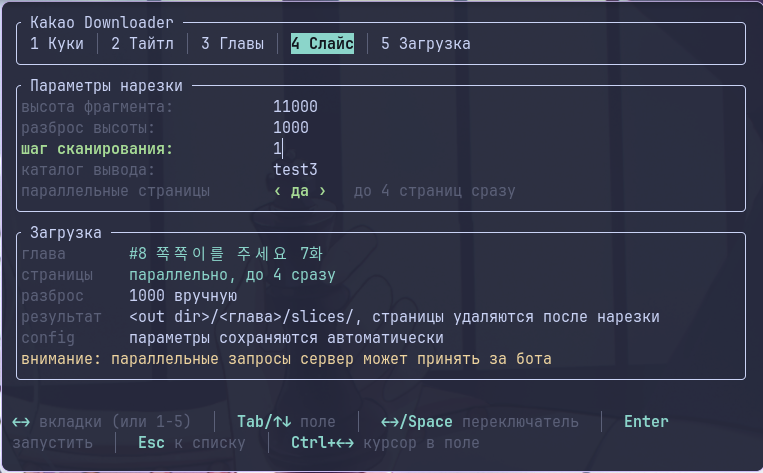
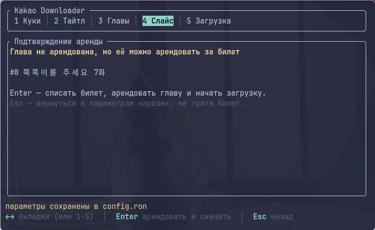
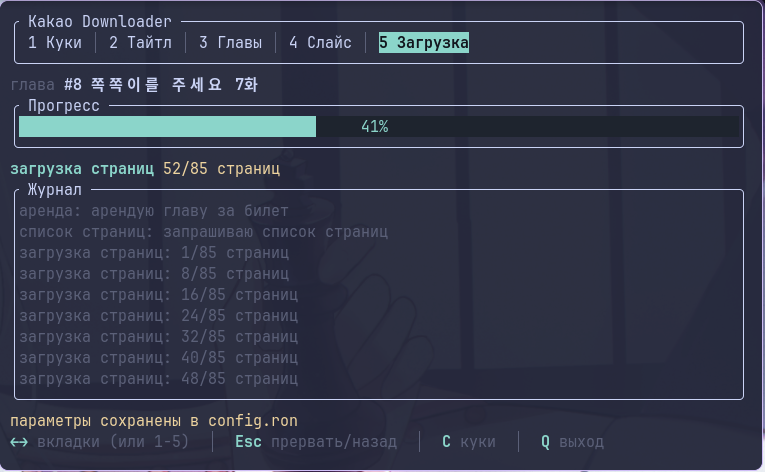
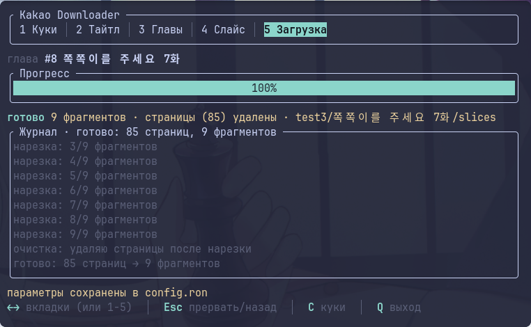
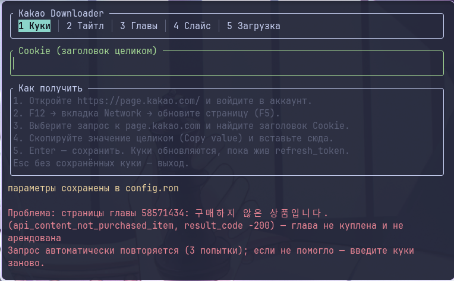
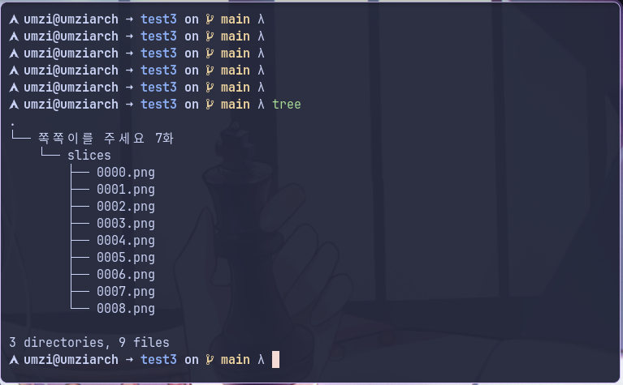

# Kakao Downloader TUI

Терминальный загрузчик глав с [page.kakao.com](https://page.kakao.com/) с автоматической нарезкой длинных вебтун-полос на удобные фрагменты.

Качает все страницы главы, склеивает их в одну вертикальную полосу, ищет «пустые» строки пикселей (стыки панелей) и режет там, где это не рвёт картинку. На выходе — PNG-фрагменты фиксированной высоты (~11000 px по умолчанию) с именами `0000.png`, `0001.png`, …

Работает поверх вашего аккаунта: используется строка `Cookie` из браузера, по ней же раз в 2 часа обновляется сессия через `refresh_token`.

---

## Что он делает

- **Список глав** — тянет каталог тайтла через `bff-page.kakao.com/api/gateway/api/v2/content/product/list` постранично (по 25 глав), догружает дальше по мере прокрутки.
- **Статусы глав** — помечает каждую главу: `✓ арендована`, `◆ за билет`, `✕ нельзя`, `? куки устарели`; истёкшая аренда (`rent_expire_dt` в прошлом) считается неарендованной.
- **Аренда за билет** — если глава не куплена, но арендуема, предлагает списать билет (`ticket/use`, тип `RT05`) перед загрузкой. Отдельный экран подтверждения — билет тратится только по `Enter`.
- **Загрузка страниц** — список файлов из `viewer/data`, скачивание с повторами (3 попытки, нарастающая пауза) и параллелизмом до 4 страниц одновременно (отключается переключателем).
- **Нарезка** — Sobel-карта границ по всей главе + поиск «швов» (см. [алгоритм](#алгоритм-нарезки)), результат — PNG-слайсы.
- **Очистка** — исходные страницы удаляются после успешной нарезки (папка `pages/`), остаются только слайсы.
- **Живое обновление куки** — фоновая задача раз в 2 часа дёргает `refresh_token` и перезаписывает `config.ron`, пока сессия жива.

## Скриншоты

Снято в терминале **≥ 100×30** (контент рассчитан на 96 колонок, список глав — 18 строк), тёмная тема, шрифт с иконками (`✓ ◆ ✕ ?`). Все кадры лежат в `screenshots/`, картинки листаются ниже таблицей-описанием.

| Файл | Экран / состояние | Что должно попасть в кадр |
|---|---|---|
| `screenshots/01-cookies.png` | Вкладка **1 Куки**, первая вкладка | Рамка `Kakao Downloader` со вкладками, поле `Cookie (заголовок целиком)`, панель `Как получить` (6 строк подсказки), активная вкладка подсвечена плашкой. В снятом кадре значение куки замазано — так и должно быть для публикации |
| `screenshots/02-title.png` | Вкладка **2 Тайтл** | Поле `Ссылка на тайтл` со вставленной ссылкой `https://page.kakao.com/content/<id>/`, под ним серый пример формата |
| `screenshots/03-chapters.png` | Вкладка **3 Главы**, список загружен | Строка `поиск / название или номер главы`, нумерация `#N`, названия глав и бейджи-статусы; в правом верхнем углу рамки — `тайтл <id> · глав N · стр 1/M`; внизу рамки — легенда `✓ арендована · ◆ за билет · ✕ нельзя · ? куки устарели`; одна строка выделена подсветкой |
| `screenshots/04-chapters-search.png` | Вкладка **3 Главы**, режим поиска | Активированный `/` поиск: строка `поиск` зелёная/жирная с курсором и введённым текстом, отфильтрованный список, в правом верхнем — уменьшившееся `стр 1/K` |
| `screenshots/05-slice.png` | Вкладка **4 Слайс** | Панель `Параметры нарезки`: `высота фрагмента`, `разброс высоты`, `шаг сканирования`, `каталог вывода` (одно поле подсвечено), `параллельные страницы  ‹ да ›   до 4 страниц сразу`; панель `Загрузка`: выбранная глава, режим страниц, строка `разброс  авто, spread / 8 = 1375`, строка про результат и `config`, предупреждение про параллельные запросы (жёлтым) |
| `screenshots/06-confirm.png` | Вкладка **4 Слайс** → экран **Подтверждение аренды** | Заголовок «Глава не арендована, но её можно арендовать за билет» (жёлтый), номер и название главы, строки про `Enter — списать билет…` и `Esc — вернуться…`. Снять можно, выбрав неарендованную, но арендуемую главу (`◆ за билет`), и нажав `Enter` на параметрах |
| `screenshots/07-run.png` | Вкладка **5 Загрузка**, процесс идёт | Строка `глава #N <название>`, прогресс-бар `Прогресс` с процентом, строка стадии (`загрузка страниц` / `анализ границ` / `нарезка`) с деталью `12/48 страниц`, панель `Журнал` с накопленными записями |
| `screenshots/08-run-done.png` | Вкладка **5 Загрузка**, завершение | Прогресс 100 %, стадия `готово`, в заголовке журнала `Журнал · готово: N страниц, M фрагментов`, в детали — путь до `…/slices` и пометка, что страницы удалены |
| `screenshots/09-error.png` | Приложение само открыло вкладку **1 Куки** после ошибки | Нижний блок `Проблема: <текст>` красным с разбором `result_code`/`message_key` (в кадре — `api_content_not_purchased_item, result_code -200`), вторая строка «Запрос автоматически повторяется (3 попытки)…» и чипы `R повторить │ C ввести куки заново │ Esc скрыть` |
| `screenshots/10-output.png` | Терминал вне TUI, `tree <out_dir>/<глава>` | Дерево результата: папка `slices/` c `0000.png … 0008.png`; папки `pages/` нет — значит она удалена после нарезки |
| `screenshots/demo.gif` *(опционально, пока не снят)* | Запись полного прохода | Куки → тайтл → выбор главы → параметры → прогресс → готово. Снять `asciinema`, собрать `agg` (или `vhs`) |

### Экран куки — вставка заголовка `Cookie`



### Выбор тайтла и списка глав







### Параметры нарезки и подтверждение аренды





### Загрузка: прогресс и результат





### Ошибка с разбором ответа API и повторами



### Что получилось на диске



## Установка

Готовые портативные сборки — в [Releases](../../releases): Linux (`x86_64`/`aarch64`, musl и gnu), Windows (`x86_64`/`aarch64`/`i686`, статический CRT), macOS (`aarch64`/`x86_64`) + `SHA256SUMS`.

Из исходников (нужен Rust ≥ 1.85 — используется edition 2024):

```bash
cargo build --release
./target/release/kakao_downloader
```

Кросс-сборка и упаковка автоматизированы в `.github/workflows/release.yml`: тег `v*` → сборка матрицы целей → архивы `kakao_downloader-<версия>-<target>.{tar.gz,zip}` → релиз на GitHub.

## Конфиг

Файл `config.ron` рядом с бинарником; создаётся/перезаписывается самим приложением (в `.gitignore` через `*.ron`, куки в репозиторий не попадают).

```ron
(
    cookie: "_kpiid=…;_kau=…;theme=dark",  // строка Cookie целиком
    spread: 11000,      // целевая высота фрагмента, px (минимум 500)
    step: 1,            // шаг сканирования по колонкам при построении карты границ
    out_dir: "tmg",     // каталог вывода
    tolerance: Some(1000), // ± вокруг целевой высоты; None = авто (spread / 8)
    parallel: true,     // качать до 4 страниц одновременно
)
```

Валидация: `out_dir` не пустой, `spread ≥ 500`, `step ≥ 1`, `tolerance` в диапазоне `1 … spread/2`. Всё, что меняется в TUI, сразу пишется в файл.

## Интерфейс

Пять вкладок, переключение — `←/→` или цифрами `1`–`5` (когда фокус не в текстовом поле).

| Экран | Клавиши |
|---|---|
| **1 Куки** | `Enter` — сохранить куки и пересобрать HTTP-клиент, `Esc` — назад (без сохранённых куки — выход) |
| **2 Тайтл** | `Enter` — загрузить список глав (принимает и ссылку `…/content/<id>/…`, и просто `<id>`), `Esc` — выход |
| **3 Главы** | `/` — поиск по названию/номеру, `↑↓`/`jk` — выбор, `PgUp`/`PgDn` — страница, `Home`/`End` — края, `Enter` — выбрать главу, `R` — перечитать список, `C` — куки, `N` — тайтл, `Esc` — выход |
| **4 Слайс** | `Tab`/`↑↓` — по полям, `←→`/`Space` — переключатель параллельности, `Enter` — сохранить и запустить, `Esc` — к списку глав |
| **Подтверждение аренды** | `Enter` — списать билет и начать, `Esc` — назад (билет не тратится) |
| **5 Загрузка** | `Esc` — прервать/назад, `C` — куки, `Q` — выход |
| **Блок «Проблема»** | `R` — повторить упавшую операцию, `C` — ввести куки заново, `Esc` — скрыть |

Вставка из буфера (`Ctrl+Shift+V` в терминале) поддерживается bracketed-paste — куки вставляются одним куском. Голые `←/→` переключают вкладки, поэтому курсор внутри текстового поля двигается `Ctrl+←/→` (в поле работают также `Home`/`End`, `Backspace`/`Delete`, `Ctrl+U` — очистить). Курсор считается по символам, Unicode и широкие восточноазиатские символы не разъезжаются. `Ctrl+C`/`Ctrl+Q` — выход из любого экрана.

ASCII-фолбэк: на Windows без современного терминала (нет `WT_SESSION`/`TERM_PROGRAM`/`WEZTERM_PANE`/`KITTY_WINDOW_ID`/`ALACRITTY_WINDOW_ID`/`ConEmuPID`) интерфейс сам переходит в чистый ASCII — кириллица транслитом, хангыль романизацией (Revised Romanization), рамки `+`/`-`/`|`, курсор `|`. Вручную: `KAKAO_ASCII=1` (включить, работает и на Linux) / `KAKAO_ASCII=0` (выключить).

Прогресс по стадиям: глава 3 % → аренда 8 % → список страниц 12 % → загрузка страниц 12–60 % → анализ границ 60–80 % → нарезка 80–98 % → очистка 99 % → готово 100 %.

## Структура вывода

```
<out_dir>/
└── <название главы>/            # «/», «\», «:», NUL заменяются на «_»
    ├── pages/                   # временная папка: 00001.jpeg, 00002.jpeg, … (удаляется после нарезки)
    └── slices/                  # результат: 0000.png, 0001.png, …
```

Фрагменты — PNG без потерь, высота ≈ `spread` (плюс-минус `tolerance`, в зависимости от того, где нашёлся шов).

## Алгоритм нарезки

1. **Карта границ** (`src/slicer/edge_map.rs`) — страницы читаются в оттенках серого, по каждой строке пикселей считается сумма модуля градиента Sobel (`gx`, `gy`, по колонкам с шагом `step`) с переходом через границы страниц: последняя строка текущей страницы берёт соседа из следующей, поэтому швы между файлами не дают ложной границы.
2. **Сглаживание и порог** (`src/slicer/cuts.rs`) — карта сглаживается окном ±4, порог «пустой строки» = 1 % от максимума.
3. **Точки реза** — идём от начала: цель следующего реза = `предыдущий рез + spread`, ищем в окне `±tolerance` самый длинный непрерывный участок ниже порога и берём его середину; если такого участка нет — берём строку с минимумом градиента в окне. Если по пути не нашлось ни одного варианта — последний рез замыкает полосу.
4. **Склейка и нарезка** (`src/slicer/slice.rs`) — страницы декодируются лениво скользящим окном (`VecDeque`), строки копируются в буфер фрагмента напрямую из RGB-сырых данных. Проверки: одинаковая ширина у всех страниц, высоты должны совпадать с посчитанными, границы строго возрастают и не выходят за общую высоту (иначе — ошибка, а не битый файл).

Опыт подбора: `spread` меньше → больше фрагментов и меньше шансов «промахнуться» мимо шва; `tolerance` больше → шов ищется в более широком окне (но растёт разброс высоты); `step > 1` ускоряет анализ (сэмплирование колонок), почти не меняя результат на длинных полосах.

## Куки и сессия

1. Откройте `https://page.kakao.com/` и войдите в аккаунт.
2. `F12` → Network → обновите страницу (`F5`).
3. Выберите любой запрос к `page.kakao.com`, найдите заголовок `Cookie`, скопируйте значение целиком.
4. Вставьте на вкладку **1 Куки** и нажмите `Enter`.

Строка разбирается по `;`/переводам строк, служебные атрибуты (`domain`, `path`, `expires`, `max-age`, `samesite`, `secure`, `httponly`, `partitioned`) молча отбрасываются, остальные пары `name=value` кладутся в `reqwest` cookie jar с `Domain=.kakao.com; Path=/`. Мусорные записи (без `=` или с некорректным именем) пропускаются, а предупреждение о них показывается в статус-строке. Пока `refresh_token` жив, клиент сам раз в 2 часа обновляет куки и перезаписывает `config.ron` (событие попадает в журнал на вкладке «Загрузка»).

Ответы `401`/`403` (а также признак «не куплено» без данных о покупке) поднимаются как «куки просрочились»: TUI открывает вкладку куки, а в блоке проблемы доступны `R` — повторить и `C` — переввести куки. После ввода куки прерванная операция (загрузка списка глав или сама загрузка) автоматически продолжается.

## Надёжность

- Все HTTP-запросы данных проходят через `with_retries`: 3 попытки с паузой 500 мс × номер попытки.
- Ошибки API разбираются по `result_code`/`message_key` (например `api_content_not_purchased_item` → «глава не куплена и не арендована»), не-JSON ответы показываются как `HTTP <код>` + первые 200 символов тела.
- Прогресс/ошибки идут через каналы `tokio`; прерывание прогона — отмена `JoinHandle` (`Esc` на вкладке «Загрузка»).

## Ограничения

- За один прогон обрабатывается **одна глава**; пакетной загрузки тайтла целиком нет.
- Одновременно допускается 4 страницы — на больших главах Kakao может отвечать медленнее; при подозрении на ограничения выключайте параллельность в параметрах нарезки.
- Требуется одинаковая ширина всех страниц главы (иначе нарезка падает с явной ошибкой).

## Лицензия

MIT — см. [LICENSE](LICENSE).
